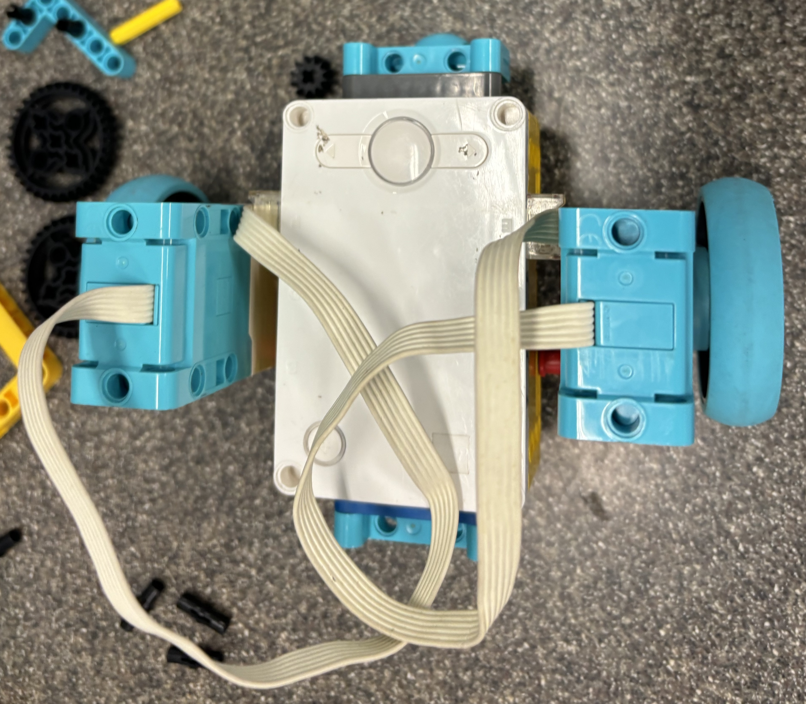

# Robotics@Apex 2024, T2-T3 Passion Project documentation
## Spike

    
Robot Design

    

        
Iteration 1

         
        

            

                
Robot Design Iteration 1 Front View

                
            

            

                
Robot Design Iteration 1 Side View

                
            

            

                
Robot Design Iteration 1 Top View

                
            

        

        

        <h4>Pros and Cons</h4>
        <h5>Pros</h5>
        <ul>
            <li>Small and Compact</li>
            <li>Robust frame</li>
            <li>Really really cute robot design</li>
        </ul>
        <h5>Cons</h5>
        <ul>
            <li>Bad CG</li>
            <li>Gyro(scope) not at pivot of turning</li>
            <li>Asymmetrical</li>
        </ul>
        

    

    

        
Iteration 2

         
        

            

                
Robot Design Iteration 2 Front View

                
            

            

                
Robot Design Iteration 2 Side View

                
            

            

                
Robot Design Iteration 2 Top View

                
            

        

        

        <h4>Pros and Cons</h4>
        <h5>Pros</h5>
        <ul>
            <li>Small and Compact</li>
            <li>CG at centre</li>
            <li>Low CG</li>
            <li>Looks cool</li>
        </ul>
        <h5>Cons</h5>
        <ul>
            <li>Assymetrical about front/back</li>
            <li>Low torque</li>
            <li>Fragile structure (prone to breaking)</li>
        </ul>
        

    

    

        
Iteration 3

         
        

            

                
Robot Design Iteration 3 Front View

                
            

            

                
Robot Design Iteration 3 Side View

                
            

            

                
Robot Design Iteration 3 Top View

                
            

        

        

        <h4>Pros and Cons</h4>
        <h5>Pros</h5>
        <ul>
            <li>CG at centre</li>
            <li>Perfect symmetry about x and y axis</li>
            <li>High torque</li>
        </ul>
        <h5>Cons</h5>
        <ul>
            <li>Relatively high CG</li>
            <li>Doesn't look very good</li>
            <li>Fragile structure (prone to breaking)</li>
        </ul>
        

    

    

        In the end, I went with the robot iteration 3, due to it's perfect symmetry and its CG being at the centre, as well as it being in line with the gyro and the exact centre of the robot. It also has the highest torque.
    

    

        
Additional modifications made

        

            I changed the wheels of the robot from the ones pictured above to the one pictured below on the right (Spike wheels --> EV3 wheels). This is because the Spike wheels did not have the grip on the floor I needed. Hence, I switched to EV3 wheels which were thicker.
        

        

            
Picture

            
Pictured are the old Spike wheels on the left and the new EV3 wheels on the right

            
        

    
    

    
Code

    <h4>14 / 09 / 2024 </h4>
    <ul>
        <li>Added live tracking of robot</li>
        
This was a huge bit

        <li>Changed how robot follows arcs</li>
        <li>Calibrated robot width</li>
        <li>Switched to use global variables</li>
    </ul>
    <h4>21 / 08 / 2024</h4>
    

        Updated a lot. Important things to note: in order to get points, the image of the surface has to be <em>perfectly</em> flat, i.e. it can't be made with just a camera, it has to be drawn or scanned.
    

    <h4>02 / 07 / 2024</h4>
    

        Simulation runs on desmos show big problem --> when tangent is parallel to the x-axis, the angle / circle is <em>undefined</em>, leading to the robot basically <em>dying</em>.
    

    <h4>28 / 06 / 2024</h4>
    

        
-- Full Log--

         
        
During CCA session

        

        

            <h4>Modifications made</h4>
            

                I managed to switch the bearing of the robot such that it counts the same way as the trigonometric calculation does. It was surprisingly easy to make the switch, especially after all the headaches it gave me. So that's done. Other modifications  are listed below. Unfortunately, not much progress was made in the way of pure pursuit.
            

        

    

    <ul>
        <li>Switched bearing of robot code to work with the Trig calculations</li>
        <li>Switched Gyro turns to use PID gyro, in commit #7914533.</li>
        <li>Removed PID gyro in commit #9a689ac, because of calculation issues</li>
        <li>Updated all parts of the pure pursuit to get new robot bearing to work.</li>
    </ul>
    <h4>27 / 06 / 2024</h4>
    

        
-- Full Log --

         
        
I just didn't wanna do list anymore, so here's a full log.

        

        

            <h4>Context</h4>
            

                Everything for the spike is pretty much done and done. The pure pursuit's algorithm is close to perfect. Other parts, such as the regression and the literally *mapping* part, where the robot travels to a set point in a straight line, is perfect. However, while debugging the pure-pursuit, code-breaking issues have been found:
            

            <ul>
                <li>Direction of robot.</li>
                <li>Trigonometric calculations.</li>
            </ul>
        

        

        

            <h4>Expanded explanation:</h4>
            

                To start calculating the direction the robot was facing, I started to code it with a gradient line (i.e., 1 means it travels 1 unit of y per unit x, 2 per unit x and so on). This quickly becomes a problem when the robot is facing sector 2 or 3 of the cartesian plane. This is because gradients are either positive or negative; It does not have an imaginary ability for it to have any meaningful value. In sector 3, the robot would have a positive gradient. This cannot be differentiatied from when the robot is facing sector 1 of the plane. Hence, I switched to using ship true bearings from a "north", which is standardised as the positive y direction, counting "clockwise". I didn't think much of this arrangement, and designed the yaw angle calculator of the robot to use it. (See below for GIFs)
                 
                The problem comes from the fact that when doing trigonometric calculations with the robot, the angle from an inverse function is always is the acute angle to the x-axis (the reference angle, α). When adjusting for sectors 2 to 4, this results in an angle (hereafter referred to as the "turning angle") that is read from the positive x direction, counting "anti-clockwise". Hence, when calculating the turning angle required to face the chosen point (from the current coordinates of the robot), the angle is red from that x direction. Although it is workable, the inherent difference between the turning angle and the robot's bearing makes calculations within the robot extremely inefficient, not to mention difficult for the coder (me). This basically means that now I have to rewrite the entire code. Or at least, make a really big patch update which makes it an effective "version 2". (Technically this is unofficially going to be version 3).
            
 
        

        

            

            <h4>GIFs!!!</h4>
                

                    <h5>Robot gradient</h5>
                    
Assume the robot is at point (0, 0) and is facing the moving blue dot. Observe m₁, and observe that m₁ is positive in secotr 1 and 3 and negative in sector 2 and 4.
 
                    
                

                

                

                    <h5>Robot bearing</h5>
                    
Assume the robot is at point (0, 0) and is facing the moving blue dot. Observe b, and observe that b decreases from 360 degrees when facing the positive y direction and decreases as it moves from sector 1 to 4, "anti-clockwise". (I.e., increases when moving from sector 4 to 1, "clockwise")

                    
                

                

                

                    <h5>Wanted angle</h5>
                    
Assume the robot is at point (0, 0) and the wanted coordinate is the moving blue dot. Observe w, the wanted angle measured from the axis in degrees. Observe that it increases as it travels from sector 1 to 4, "anti-clockwise", while the reference angle, α, alternates between the increasing and decreasing.

                    
                

            

        

         
        

        TL;DR: I need a lot more time because I need to rewrite almost the entire code.
    <h4>08 / 05 / 2024 to 27 / 06 / 2024</h4>
    <ul>
        <li>Debugging and testing</li>
    </ul>
    

    <h4>08 / 05 / 2024</h4>
    <ul>
        <li>General Arc Stuff</li>
        <li>Added formula to calculate the Arc needed to follow for the robot to arrive at next point, taking into account everything</li>
    </ul>
    

    <h4>30 / 04 / 2024</h4>
    <ul>
        <li>Added alternate to pure pursuit</li>
        <li>Added support if pure pursuit returns no intersections: Continue towards f(x + 1), or f(x - 1) in case of direction</li>
        <li>Added pursuit towards points following the heading (pictured below)</li>
        <li></li>
        <li>Added images</li>
        <li>Removed pure pursuit due to too many errors</li>
        <li>Optimised curve following</li>
    </ul>
    <h4>29 / 04 / 2024</h4>
    <ul>
        <li>Added base mapping (straight line point 1 to 2 with spot turns)</li>
        <li>Added support for moving backwards</li>
        <li>Fixed issue of going forward when no intersections are found</li>
        <li>Added matplotlib for plotting</li>
    </ul>
    

