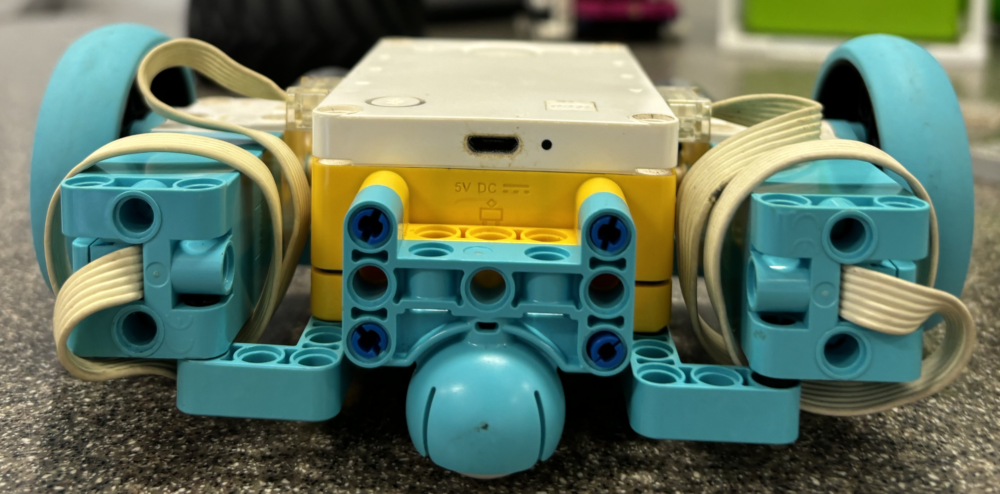
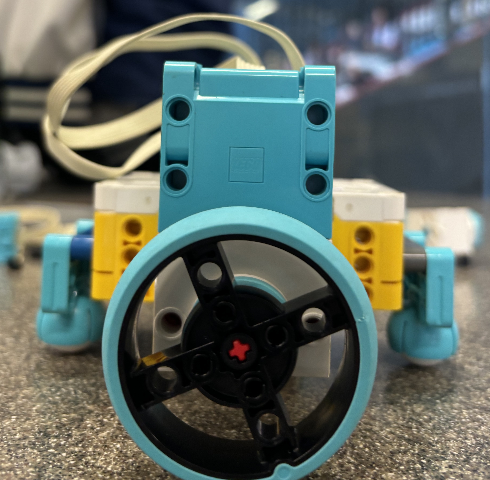

# Robotics@Apex 2024, T2-T3 Passion Project documentation
## Spike
### Robot Design
#### Iteration 1: 
Robot Design Iteration 1 Front View

Robot Design Iteration 1 Side View

Robot Design Iteration 1 Top View

#### Pros and Cons
##### Pros
- Small and Compact
- Robust frame
- Really really cute bot
###### Cons
- Bad CG
- Gyro not in at pivot of turning
- Asymmetrical

#### Iteration 2:
Robot Design Iteration 2 Front View

Robot Design Iteration 2 Side View

Robot Design Iteration 2 Top View

#### Pros and Cons
##### Pros
- Small and Compact
- CG at centre
- Low CG
- Looks cool
###### Cons
- Assymetrical 
- Low torque
- Fragile structure

#### Iteration 3:
Robot Design Iteration 3 Front View

Robot Design Iteration 3 Side View

Robot Design Iteration 3 Top View

#### Pros and Cons
##### Pros
- CG at centre
- Perfect symmetry
- High torque
###### Cons
- Relatively high
- Looks bad
- Fragile structure
Still chosen though
#### Small additions made
- Switched wheels

### Code

08 / 05 / 2024
- General Arc stuff

30 / 04 / 2024
- Added alternate to pure pursuit
- Added support if pure pursuit returns no intersections: Continue towards f(x + 1), or f(x - 1) in case of direction
- Added pursuit towards points following the heading

- Added images
- Removed pure pursuit due to too many errors
- Optimised curve following

29 / 04 / 2024
- Added everything so far
- Added support for moving backwards
- fixed issue of going forward due to low precision
- added matplotlib for plotting

27 / 06 / 2024

-- Full Log --

 
I just didn't wanna do a status update anymore.

Everything for the spike is pretty much done and done. The pure pursuit's algorithm is close to perfect. Other parts, such as the regression and the literally *mapping* part, where the robot travels to a set point in a straight line, is perfect. However, while debugging the pure-pursuit, code-breaking issues have been found:
<ul>
<li>Direction of robot.</li>
<li>Trigonometric calculations.</li>
</ul>

<h4>Expanded explanation:</h4>
To start calculating the direction the robot was facing, I started to code it with a gradient line (i.e., 1 means it travels 1 unit of y per unit x, 2 per unit x and so on). This quickly becomes a problem when the robot is facing sector 2 or 3 of the cartesian plane. This is because gradients are either positive or negative; It does not have an imaginary ability for it to have any meaningful value. In sector 3, the robot would have a positive gradient. This cannot be differentiatied from when the robot is facing sector 1 of the plane. Hence, I switched to using ship true bearings from a "north", which is standardised as the positive y direction, counting "clockwise". I didn't think much of this arrangement, and designed the yaw angle calculator of the robot to use it. (See below for GIFs)
 
The problem comes from the fact that when doing trigonometric calculations with the robot, the angle from an inverse function is always is the acute angle to the x-axis (the reference angle, α). When adjusting for sectors 2 to 4, this results in an angle (hereafter referred to as the "turning angle") that is read from the positive x direction, counting "anti-clockwise". Hence, when calculating the turning angle required to face the chosen point (from the current coordinates of the robot), the angle is red from that x direction. Although it is workable, the inherent difference between the turning angle and the robot's bearing makes calculations within the robot extremely inefficient, not to mention difficult for the coder (me). This basically means that now I have to rewrite the entire code. Or at least, make a really big patch update which makes it an effective "version 2". (Technically this is unofficially going to be version 3). 

<h4>GIFs!!!</h4>
Robot gradient: Assume the robot is at point (0, 0) and is facing the moving blue dot. Observe m₁, and observe that m₁ is positive in secotr 1 and 3 and negative in sector 2 and 4.

Robot bearing: Assume the robot is at point (0, 0) and is facing the moving blue dot. Observe b, and observe that b decreases from 360 degrees when facing the positive y direction and decreases as it moves from sector 1 to 4, "anti-clockwise". (I.e., increases when moving from sector 4 to 1, "clockwise")

Wanted angle: Assume the robot is at point (0, 0) and the wanted coordinate is the moving blue dot. Observe w, the wanted angle measured from the axis in degrees. Observe that it increases as it travels from sector 1 to 4, "anti-clockwise", while the reference angle, α, alternates between the increasing and decreasing.

 

TL;DR: I need a lot more time because I need to rewrite almost the entire code.
